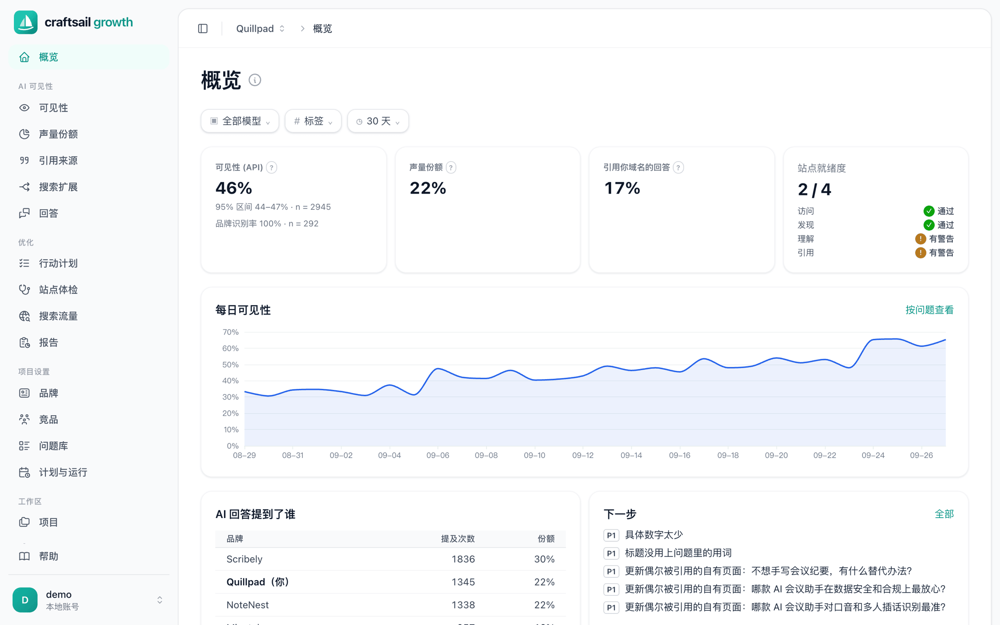
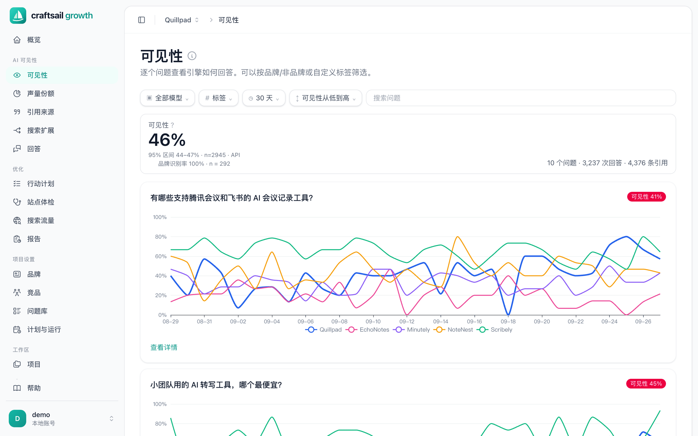
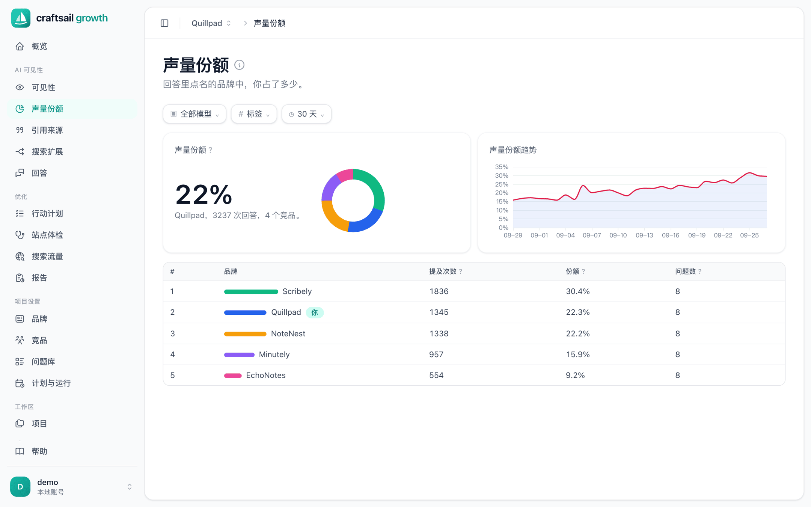
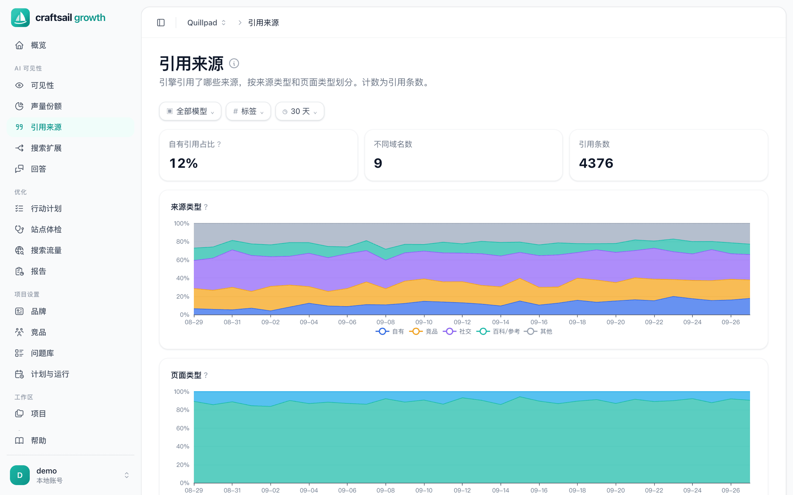
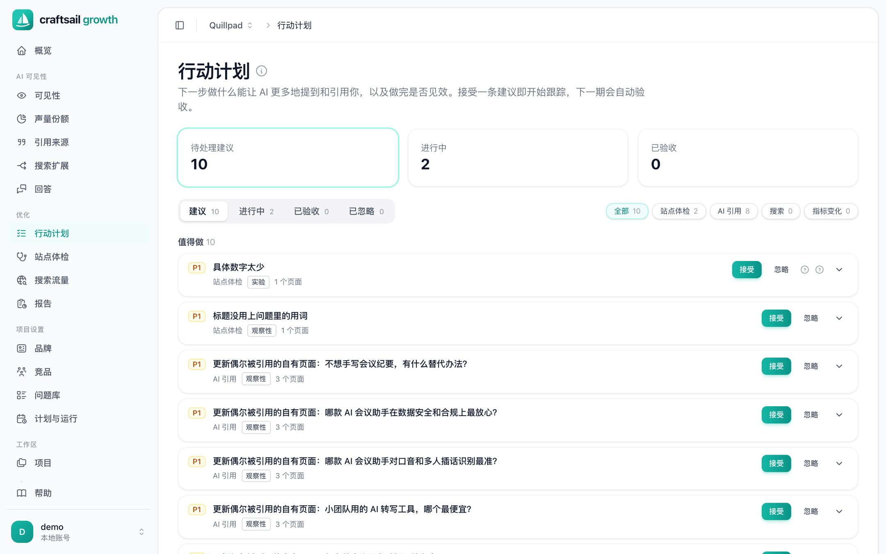
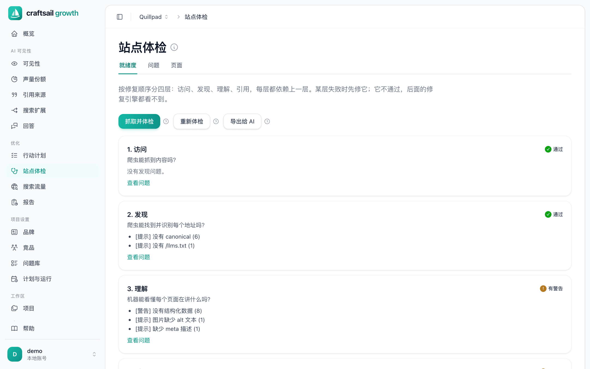
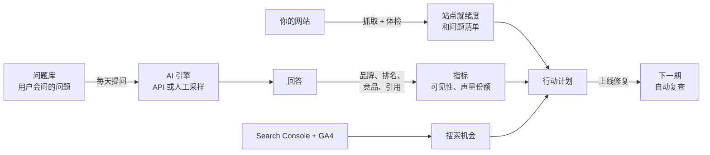

<div align="center">


# craftsail-growth

**看清 DeepSeek、豆包、Kimi、ChatGPT、Claude 等 AI 怎么介绍你的品牌，并知道该改什么才能被推荐。**

开源、可自托管的 GEO（生成式引擎优化）与 SEO 看板。
一个 Go 二进制文件，默认使用 SQLite，数据只留在你自己的服务器上。

[](https://github.com/craftsail/craftsail-growth/actions/workflows/ci.yml)
[](LICENSE)
[](go.mod)
[](CONTRIBUTING.md)

[English](README.md) · [简体中文](README.zh-CN.md)

[一分钟体验](#一分钟体验演示) · [快速开始](#快速开始) · [功能](#功能) · [工作原理](#工作原理)



</div>

## 为什么需要它

越来越多的用户不再搜索，而是直接问 AI。如果 AI 的回答里列了三个竞品却没有你，生意在开始之前就丢了，而传统的 SEO 工具看不到这一点。

craftsail-growth 每天用你的目标用户会问的问题去问各个 AI 引擎，并统计：

- **有没有提到你？** 按引擎、按问题统计可见性，并给出置信区间，而不是一个好看但不可靠的数字。
- **谁取代了你？** 与你关注的竞品对比声量份额。
- **答案引用了哪些来源？** 每一条被引用的链接，按自有、竞品、测评、社区、百科等类型归类。
- **下一步该做什么？** 综合 AI 引用、站点体检和 Search Console 生成按优先级排序的行动计划，上线后自动复查是否见效。

## 功能

<table>
<tr>
<td width="50%"><b>按问题看可见性</b><br>你和每个竞品在每道问题、每个引擎上的提及率变化。<br></td>
<td width="50%"><b>声量份额</b><br>你在所有品牌提及中的占比、排行榜和趋势。<br></td>
</tr>
<tr>
<td><b>引用来源</b><br>AI 引用了哪些网站和哪类页面，你自己的页面被引用了多少。<br></td>
<td><b>行动计划</b><br>按优先级排序、标明证据等级的建议，每条都带完成标准，下一期自动验收。<br></td>
</tr>
<tr>
<td><b>面向 AI 爬虫的站点体检</b><br>按修复顺序分四层：访问、发现、理解、引用。覆盖 AI 爬虫的 robots 规则、llms.txt、结构化数据和可被引用的内容。<br></td>
<td><b>还有</b>
<ul>
<li>搜索扩展：AI 实际发出的联网搜索词</li>
<li>查看每一条原始回答，可人工复核和修正</li>
<li>没有 API 的引擎可导出表格人工采样</li>
<li>接入 Google Search Console 和 GA4</li>
<li>根据品牌事实生成 llms.txt、JSON-LD 和 FAQ 片段</li>
<li>定时运行、周期报告、多项目多用户</li>
<li>看板支持中文、英文和葡萄牙文</li>
<li>完整的命令行，方便脚本和 cron 调用</li>
</ul></td>
</tr>
</table>

**支持的引擎**：DeepSeek、豆包、Kimi、智谱 GLM、MiniMax、OpenAI（ChatGPT）、Claude、Gemini、Grok、Perplexity。任何兼容 OpenAI 接口的中转服务都可以通过 `*_BASE` 接入。

## 一分钟体验演示

不需要任何 API key。下面的命令会用一个虚构品牌 Quillpad 和 30 天的模拟回答生成演示数据，然后打开看板：

```sh
git clone https://github.com/craftsail/craftsail-growth.git
cd craftsail-growth
make demo DEMO_LANG=zh    # 需要 Go 1.23+ 和 Node.js 20+
```

用 `demo` / `quillpad-demo-2026` 登录。只有 AI 的回答是模拟的，抓取、体检、引用分析、指标计算和行动计划都走真实代码。

## 快速开始

### Docker

单容器、SQLite，提供 `linux/amd64` 和 `linux/arm64` 两种架构的镜像：

```sh
docker run -d --name craftsail-growth -p 8765:8765 \
  -e CRAFTSAIL_GROWTH_TOKEN=$(openssl rand -hex 24) \
  -e CRAFTSAIL_GROWTH_PASSWORD='replace-with-your-own-secret' \
  -v craftsail-growth-data:/app/data \
  -v craftsail-growth-config:/app/config \
  ghcr.io/craftsail/craftsail-growth:latest
```

token 是管理员 API token，监听所有网卡时必须设置。用 Docker Compose 的话，[deploy/compose.sqlite.yml](deploy/compose.sqlite.yml) 的用法相同。

打开 <http://localhost:8765>，用 `admin` 登录。在“**工作区 → 模型服务商**”里至少填一个引擎的 key，然后用你的网站地址创建项目；第一次运行会自动起草品牌事实、竞品和问题库，供你审核。

> [!IMPORTANT]
> 没有设置 `CRAFTSAIL_GROWTH_PASSWORD` 时，首次启动会创建 `admin` / `craftsailgrowth`，第一次登录时看板会要求设置新密码，改好之前接口拒绝其他所有请求。谁先登录，谁就能设置这个密码，所以部署在别人能访问到的服务器上时，一定要设置 `CRAFTSAIL_GROWTH_PASSWORD`。对公网开放前请加上 HTTPS（参考 [deploy/nginx.conf](deploy/nginx.conf)）。

如果要用 MySQL 8 代替 SQLite，请使用 `deploy/compose.yml`（用法见文件开头的注释）。

### 从源码构建

```sh
make build              # 先构建看板，再构建 craftsail-growth 二进制
./craftsail-growth ui   # 首次运行会生成 config/default.toml，并打开看板
```

构建产物是一个内嵌了看板的二进制文件，拷到同系统、同架构的机器上就能直接运行，不需要装其他东西。

## 工作原理



1. **创建项目**：输入网站地址，系统抓取站点，并起草品牌事实、竞品和问题库，供你审核。
2. **采样**：按计划在每个引擎上提问，每天多轮，让数字带有置信区间。
3. **分析**：每条回答是否提到品牌、排第几、出现了哪些竞品、引用了哪些链接。
4. **行动**：按排好的计划去做。接受的行动都带完成标准，下一期告诉你有没有见效。

## 配置

首次运行会把 [config/default.example.toml](config/default.example.toml) 复制为 `config/default.toml`（该文件不纳入 git）。

| 配置段 | 用途 |
|---|---|
| `[server.http]` | 监听地址和端口，默认 `127.0.0.1:8765`。 |
| `[db]` | `dialect = "sqlite"`（默认，数据文件为 `data/craftsail-growth.db`）或 `"mysql"`。 |
| `[auth]` | 首个管理员和可选的 API token。 |
| `[keys]` | 各引擎的 API key 和 Google 凭据；也可以在看板的“工作区 → 模型服务商”里设置。 |

环境变量的优先级高于配置文件：

| 变量 | 用途 |
|---|---|
| `CRAFTSAIL_GROWTH_HOST` | 监听地址。非回环地址必须同时设置 token。 |
| `CRAFTSAIL_GROWTH_TOKEN` | 管理员 API token，放在请求头 `X-Craftsail-Growth-Token` 中。 |
| `CRAFTSAIL_GROWTH_USER`、`CRAFTSAIL_GROWTH_PASSWORD` | 首个管理员，仅在用户表为空时生效。 |
| `DEEPSEEK_API_KEY`、`ARK_API_KEY`（豆包）、`MOONSHOT_API_KEY`（Kimi）、`ZHIPUAI_API_KEY`、`OPENAI_API_KEY` 等 | 各引擎的 key；用 `*_BASE`、`*_MODEL` 覆盖接口地址和模型。 |

**Google Search Console 与 GA4**：用服务账号（`GOOGLE_SA_JSON`）或 OAuth（`GOOGLE_OAUTH_CLIENT_ID` / `_SECRET`），在看板的“工作区 → Google 搜索与 GA4”里连接。

## 命令行

这个二进制文件同时也是 CLI，和看板使用同一个数据库：

```sh
craftsail-growth new --url https://example.com   # 创建项目并跑第一个周期
craftsail-growth serve --slug example            # 完整跑一个周期：抓取、体检、采样、搜索、复查、报告
craftsail-growth sample --slug example           # 只做 AI 回答采样
craftsail-growth opportunities --slug example    # 排好序的行动计划
craftsail-growth user passwd admin               # 重置密码（从标准输入读取）
craftsail-growth --help                          # 其他命令
```

## 常见问题

**会去抓取 ChatGPT、豆包等网页版吗？**
不会，只调用官方 API。没有 API 的引擎或产品形态，可以导出采样表格人工填写后再导入。

**和 SEO 工具有什么区别？**
SEO 工具看排名和点击；这个工具看 AI 的回答有没有提到你、有没有引用你，同时也接入 Search Console 的传统搜索数据。

**我的数据会发到哪里？**
只会发到你自己的服务器、你配置的引擎 API，以及你连接 Search Console 时的 Google。没有任何遥测。

**采样要花多少钱？**
10 个问题、5 个引擎、每天 3 轮，大约每天 150 次简短的 API 调用。每次运行的计划调用数和 token 估算都记录在“计划与运行”页面。

## 架构

```
cmd/craftsail-growth   程序入口
internal/cli           cobra 命令；组装配置、数据库和各个服务
internal/api           HTTP 接口（gin）与鉴权
internal/router        提供内嵌的看板页面
internal/service/*     业务逻辑，每个领域一个包
                       （sample、audit、crawl、webstats、opportunity、report 等）；
                       jobs 和 pipeline 负责编排其他服务
internal/repo          数据库访问（gorm）
internal/model         数据表与迁移
internal/pkg/*         不含业务逻辑的小工具
web/                   React + Vite + Tailwind 看板，构建时嵌入二进制
deploy/                Docker Compose、nginx 和 MySQL 示例
scripts/demo           演示数据生成器和截图脚本
```

依赖只朝一个方向：`cli → api → service → repo → model`。

## 参与贡献

欢迎提交 issue 和 PR，请先阅读 [CONTRIBUTING.md](CONTRIBUTING.md)。界面规范（多语言、导航、配色）见 [AGENTS.md](AGENTS.md)。安全漏洞请按 [SECURITY.md](SECURITY.md) 报告。

如果这个项目对你有帮助，点个 ⭐ 能让更多人发现它。

## 许可证

[GNU Affero 通用公共许可证 v3.0 或更高版本](LICENSE)。如果你把修改后的版本作为网络服务运行，就必须向该服务的用户提供修改后的源代码。

各服务商图标来自 [LobeHub Icons](https://github.com/lobehub/lobe-icons)（MIT 许可，见 [web/src/assets/providers/LICENSE.md](web/src/assets/providers/LICENSE.md)）。产品名称和图标是其所有者的商标，这里只用于标识对应的引擎。演示品牌 Quillpad 及其竞品均为虚构。
